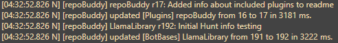

# repoBuddy

A RebornBuddy plugin that automatically updates add-ons from configured repositories.

Commonly used repositories are already [included in `repoBuddyRepos.xml`](#included-repos). To remove undesired add-ons, edit `repoBuddyRepos.xml` or configure via Plugins > repoBuddy > Settings before enabling repoBuddy.

ℹ️ Any updates to `Default.repoBuddyRepos.xml` will require you to delete `repoBuddyRepos.xml` in order to receive added/removed repos automatically. If you don't want to lose existing settings, you can also manually add or remove the changed entries.

## Installation

1. Close RebornBuddy if it's already running.
2. Install [Microsoft Visual C++ 2010 SP1](https://www.microsoft.com/en-us/download/details.aspx?id=26999). Choose the `vcredist_x64.exe` version.
3. Download [`repoBuddy-master.zip`](https://github.com/Zimgineering/repoBuddy/archive/master.zip).
4. ⚠️**Before** extracting, unblock the `.zip` file: right click > Properties > Unblock > Apply
5. Extract RepoBuddy to `RebornBuddy\Plugins\`, **removing `-master`** so it looks like:
   ```
   RebornBuddy
   └── Plugins
       └── repoBuddy
           ├── repoBuddy.cs
           └── ...
   ```
6. Delete any existing add-on folders that are included in `Default.repoBuddyRepos.xml` to prevent errors later.
7. Launch RebornBuddy.
8. In the Plugins tab, enable "repoBuddy", then let the bot restart and auto-install add-ons.
9. Revisit Plugins > repoBuddy, then click > Settings > One-Time Downloads.
10. Install any desired one-time downloads, then click "Restart RebornBuddy" for one last auto-install.

## Proxy/VPN settings

Edit the following file in a text editor (e.g., Notepad). `%appdata%` will auto-expand to the correct folder.

Config file: `%appdata%\Subversion\servers`

Example:

```ini
[global]
http-proxy-host = 127.0.0.1
http-proxy-port = 4200
```

[Thanks to Lazy-Pupu!](https://github.com/Zimgineering/repoBuddy/issues/10#issuecomment-1100777062)

## Included Repos

### Quest Behaviors

- [LlamaLibrary](https://github.com/nt153133/__LlamaLibrary) - Common code used in many other add-ons.

### BotBases

- [DeepDive-Combined](https://github.com/nt153133/DeepDive) - Palace of the Dead and Heaven on High BotBase. Don't run HoH solo.
- [Kombatant](https://github.com/akira0245/Kombatant) - Much better combat BotBase with auto-following, etc.
- [LlamaUtilities](https://github.com/nt153133/LlamaUtilities) - Misc BotBases, including retainers, daily hunts, materia, inventory management, GC Turn-In, and more.
- [ResplendentTools](https://github.com/Sykel/ResplendentTools) - Auto-crafts the Resplendent Tools.

### Plugins

- [AlertMe](https://github.com/parrot-dev/AlertMe) - Chat/emote monitoring.
- [CarbuncleTech](https://github.com/nt153133/CarbuncleTech) - Mostly for SeleCR, but includes a zoom hack and title bar changer.
- [DungeonAssist](https://github.com/BurnUnit83/DungeonAssist) - Mostly used with DomesticWarlord86's Resistance Weapons profiles.
- [ExBuddy](https://github.com/Entrax643/ExBuddy) - Adds Enable Flight plugin and behaviors required for Mew and certain profiles.
- [Gluttony](https://github.com/domesticwarlord86/Gluttony) - Automatically consumes food and medicine.
- [LlamaPlugins](https://github.com/nt153133/LlamaPlugins) - Includes FC Buff manager, Lisbeth Ventures, and AutoRepairLisbeth.
- [LogJanitor](https://github.com/bismuth-dev/LogJanitor) - Adds log folder button and auto-deletes old log files.
- [Osiris](https://github.com/domesticwarlord86/Osiris) - Better death handling.
- [RBtrust](https://github.com/athlon18/RBtrust) - Trust plugin; enable the plugin and load an OrderBot profile from the `RBtrust\Profiles` folder.
- [ResistAssist](https://github.com/BurnUnit83/ResistAssist) - For use with DomesticWarlord86's profiles in Bozja and Eureka.
- [repoBuddy](https://github.com/Zimgineering/repoBuddy) - Auto-updating your auto-updater!

### Profiles

- [Angles24/DoH-DoL-Profiles](https://github.com/Angles24/DoH-DoL-Profiles) - Levels your crafters and gatherers to max!
- [DomesticWarlord86](https://github.com/domesticwarlord86/RebornProfiles) - Zodiac/Resistance Weapons, Blue mage, Eureka, etc.
- [Sodimm](https://github.com/sodimm/RebornBuddy/tree/master/Profiles/Sodimm) - Profiles for dailies, MSQ, etc.
- [Y2Krazy](https://github.com/y2krazy/RebornBuddy-Profiles) - Anything not in Sodimm's are likely here.

## Warnings

- You will lose local changes to files when an update is processed, but unversioned files should not be lost.
- If you run into any issues, please try a clean checkout by either deleting the repo folder or the hidden `.svn` folder and restarting RebornBuddy.

## Screenshots




## About SharpSVN

[SharpSvn](https://sharpsvn.open.collab.net/) is a binding of the Subversion Client API for .Net 2.0-4.0+ applications contained within a set of xcopy-deployable dll's and is licensed under the Apache 2.0 license, to allow using it in both open source and commercial projects

## Special thanks to

[Kayla D'orden](https://github.com/nt153133)
