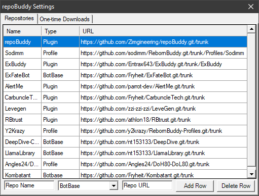

# repoBuddy
A plugin for the RebornBuddy FFXIV MMO bot to automatically update accessories from repositories.

[Included in repoBuddyRepos.xml](#included-repos) are a number of commonly used repos, if you do not want any of those then remove the relevant data in the xml (using a text editor) or using the settings button before enabling.
>Any updates to Default.repoBuddyRepos.xml will require you to delete repoBuddyRepos.xml in order to recieve added/removed repos automatically.
# Installation
SharpSvn requires Microsoft Visual C++ 2010 SP1 Redistributable Package to function, click download [HERE](https://www.microsoft.com/en-us/download/details.aspx?id=26999) and you'll get a prompt to select the version (choose x64)
1. Download using your preferred method or [HERE](https://github.com/Zimgineering/repoBuddy/archive/master.zip)
    >make sure to unblock the file (properties->unblock checkbox)
2. Extract the archive into your plugins directory (remove -master from the folder name if necessary)
    >should look like this: Rebornbuddy/Plugins/repoBuddy/sharpSVN.dll
3. Delete any old repositories that might be in the included repoBuddyRepos.xml to prevent errors and namespace conflicts
4. Enable repoBuddy in your plugins section ~~and restart rebornbuddy when the process is complete for changes to take effect~~ v0.0.0.2+ forces a restart after a botbase/plugin/routine gets updated.
5. Click any of the direct download buttons on the One-Time downloads tab, and once finished click Restart RebornBuddy.

# Included Repos

**Botbases**:  
[DeepDive-Combined](https://github.com/nt153133/DeepDive) - Palace of the Dead and Heaven on High botbase. Don't run HoH solo.  
[Kombatant](https://github.com/akira0245/Kombatant) - Much better combat botbase, features autofollowing etc.  
[LlamaLibrary](https://github.com/nt153133/LlamaLibrary) - Mostly for developers, Angles24 profiles require this. Includes botbases for desynth/retainers/materia/autotrade/autofollow.  

**Plugins**:  
[AlertMe](https://github.com/parrot-dev/AlertMe) - Chat/emote monitoring.  
[CarbuncleTech](https://github.com/Fryheit/CarbuncleTech) - Mostly for SeleCR but includes a zoom hack and titlebar changer.  
[DungeonAssist](https://github.com/BurnUnit83/DungeonAssist) - Mostly used with DomesticWarlord86's Resistance Weapons profiles.  
[ExBuddy](https://github.com/Entrax643/ExBuddy) - Adds Enable Flight plugin and behaviors required for Mew and certain profiles.  
[LeveGen](https://github.com/zzi-zzi-zzi/LeveGen) - Generates leve profiles.  
[LisbethVentures](https://github.com/nt153133/LisbethVentures) - Reactivates retainer ventures using Lisbeth hooks.  
[RBtrust](https://github.com/athlon18/RBtrust) - Trust plugin; enable the plugin and load a profile from the RBtrust folder.  
[ResistAssist](https://github.com/BurnUnit83/ResistAssist) - For use with DomesticWarlord86's profiles in Bozja and Eureka.  
[repoBuddy](https://github.com/Zimgineering/repoBuddy) - Auto-updating your auto-updater!  

**Profiles**:  
[Angles24/DoH80-DoL80](https://github.com/Angles24/DoH80-DoL80) - Profiles to level your DoH/DoL, requires [LlamaLibrary](https://github.com/nt153133/LlamaLibrary) and [Lisbeth](https://www.siune.io/products/lisbeth).  
[DomesticWarlord86](https://github.com/domesticwarlord86/RebornProfiles) - Zodiac/Resistance Weapons, Blue mage, Eureka, etc.
[Sodimm](https://github.com/sodimm/RebornBuddy/tree/master/Profiles/Sodimm) - Profiles for dailies, MSQ, etc.  
[Y2Krazy](https://github.com/y2krazy/RebornBuddy-Profiles) - Anything not in Sodimm's are likely here.  

# Warnings
* You will lose local changes to files when an update is processed, but unversioned files should not be lost.
* If you run into any issues please try a clean checkout by either deleting the repo folder or the hidden .svn folder and restarting RebornBuddy

# About SharpSVN
[SharpSvn](https://sharpsvn.open.collab.net/) is a binding of the Subversion Client API for .Net 2.0-4.0+ applications contained within a set of xcopy-deployable dll's and is licensed under the Apache 2.0 license, to allow using it in both open source and commercial projects 

# Special thanks to
[Kayla D'orden](https://github.com/nt153133)
